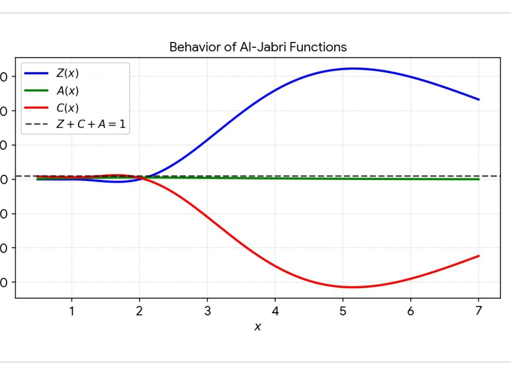

#file=README.md
#repo=Jabri-web

# Jabri-web

#Page: Jabri-web.github.io Database

# Eng. Abdulla Mohammed Nasser Al-Jabri
### م. عبدالله محمد ناصر الجبري

**Independent Researcher in Mathematics & Theoretical Physics**  
**باحث مستقل في الرياضيات والفيزياء النظرية**

**Research Focus:** Zx Function & Millennium Problems  
**مجال البحث:** دالة Zx ومسائل الألفية

[[Visit Profile](https://img.shields.io/badge/Visit-GitHub%20Profile-6ae3ff?style=for-the-badge&logo=github)](https://github.com/Jabri-web)

<!-- GitHub Stats Badges -->
[[Profile Views](https://komarev.com/ghpvc/?username=Jabri-web&color=6ae3ff&style=for-the-badge&label=Visitors)](https://github.com/Jabri-web)
[[GitHub Stars](https://img.shields.io/github/stars/Jabri-web/Jabri-web?color=yellow&style=for-the-badge&logo=github)](https://github.com/Jabri-web/Jabri-web)
[[GitHub Followers](https://img.shields.io/github/followers/Jabri-web?color=green&style=for-the-badge&logo=github)](https://github.com/Jabri-web?tab=followers)

---

---

<!-- MIDDLE:START -->
## 🗂️ Project Ecosystem / النظام البيئي للمشروع

**Jabri-web** هو الجذر - قاعدة البيانات الرئيسية  
منه تتفرع 9 مستودعات، كلها تطبق **الدالة الأم: Zx = Z + C + A**

### 🌳 الشجرة البحثية
1. **jabri_lab** - محاكاة كونيات Zx
2. **Jabri_Nobble** - أرشيف مسائل الألفية Nobel + Jabri Identity  
3. **Zx_RiemannOS** - إطار فرضية ريمان
4. **Zx_RieOS_v1.2 / v1.1** - الخوارزميات والتحقق العددي
5. **Zx_Mother_Function_Jabri** - تعريف واشتقاق الدالة الأم
6. **Jabri_Checkout** - سكريبتات الاختبار

**الفكرة:** شجرة بحث واحدة بجذر واحد = Zx
<!-- MIDDLE:END -->
---

### 📄 License / الترخيص
**CC BY 4.0** - Free to use with attribution  
**Jabri Identity:** `Z + C + A = 1`

---

## 📚 Main Repositories / المستودعات الرئيسية
[نفس قائمتك ممتازة]

## 📑 Published Papers with DOI  
[نفس قائمتك ممتازة]

## 🔗 Contact
[نفس بياناتك]

<strong>From Sana'a to the Universe / من صنعاء إلى الكون 🇾🇪</strong>

