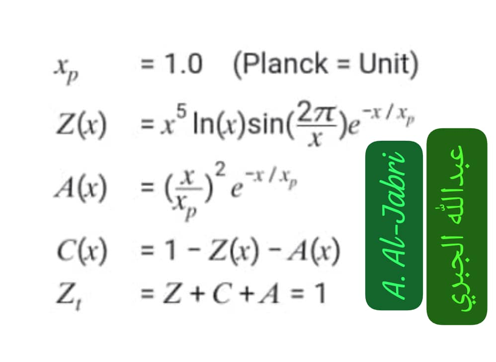

#General README.md

# Eng. Abdulla Mohammed Nasser Al-Jabri
### م. عبدالله محمد ناصر الجبري
**Independent Researcher in Mathematics & Theoretical Physics**  
**باحث مستقل في الرياضيات والفيزياء النظرية**  
**Research Focus:** Zx Function & Millennium Problems  
**مجال البحث:** دالة Zx ومسائل الألفية

[[ORCID iD](https://img.shields.io/badge/ORCID-0009--0003--3319--3822-A6CE39?style=for-the-badge&logo=orcid&logoColor=white)](https://orcid.org/0009-0003-3319-3822)

[[Visit Profile](https://img.shields.io/badge/Visit-GitHub%20Profile-6ae3ff?style=for-the-badge&logo=github)](https://github.com/Jabri-web)

[[Profile Views](https://komarev.com/ghpvc/?username=Jabri-web&color=6ae3ff&style=for-the-badge&label=Visitors)](https://github.com/Jabri-web)
[[GitHub Stars](https://img.shields.io/github/stars/Jabri-web?color=yellow&style=for-the-badge&logo=github)](https://github.com/Jabri-web?tab=repositories)
[[GitHub Followers](https://img.shields.io/github/followers/Jabri-web?color=green&style=for-the-badge&logo=github)](https://github.com/Jabri-web?tab=followers)

### 🏆 Achievements / الإنجازات
[[YOLO](https://img.shields.io/badge/YOLO-Explorer-00ffc8?style=for-the-badge&logo=github)](https://github.com/Jabri-web)
[[Code Vault](https://img.shields.io/badge/Arctic%20Code%20Vault-Contributor-6ae3ff?style=for-the-badge&logo=github)](https://github.com/Jabri-web)

---

---

### 📄 License / الترخيص
**CC BY 4.0** - Free to use with attribution  
**Jabri Identity:** `Z + C + A = 1`

---

## 🔗 Dbase: All Research Links & DOIs

### 🚪 Main Gateway / البوابة الرئيسية

  

<h2 align="center">▶️ 🚀 Press here / اضغط هنا لعرض كل الروابط 📚</h2>

 

| # | المشروع / Project | GitHub Pages | DOI Zenodo |
| --- | --- | --- | --- |
| 1 | **Jabri6218.github.io** | [Pages](https://jabri-web.github.io/jabri62018.github.io/) | [20403864](https://doi.org/10.5281/zenodo.20403864) |
| 2 | **Zx_RieOS_v1.2** | [Pages](https://jabri-web.github.io/Zx_RieOS_v1.2/) | [20100622](https://doi.org/10.5281/zenodo.20100622) |
| 3 | **Zx_Mother_Function_Jabri** | [Pages](https://Jabri-web.github.io/Zx_Mother_Function_Jabri/) | - |
| 4 | **Jabri-web.github.io** | [Pages](https://Jabri-web.github.io/) | [20499365](https://doi.org/10.5281/zenodo.20499365) |
| 5 | **Jabri_Nobble** | [Pages](https://jabri-web.github.io/Jabri_Nobble/) | [20148770](https://doi.org/10.5281/zenodo.20148770) |
| 10 | **Jabri-web** | [Pages](https://jabri-web.github.io/Jabri-web/) | [20499365](https://doi.org/10.5281/zenodo.20499365) |

> **Verified 2026-06-09 by Jabri**: كل الروابط 1-10 شغالة. DOI كله `10.5281`. لا تعديل بعد اليوم.

---

## 📘 About This Repo

<h2 align="center">📘 About This Repo / حول هذا الريبو</h2>

 

  

---
## 📊 GitHub Stats

  

## 🤝 Partnerships & Contact
مهتم بشراكة بحثية أو إعلان مدفوع؟ تواصل معي:

### 🔗 Contact
- **ORCID:** [0009-0003-3319-3822](https://orcid.org/0009-0003-3319-3822)  
- **Email:** [jabri.2018@gmail.com](mailto:jabri.2018@gmail.com)  
- **Website:** [Jabri-web.github.io](https://Jabri-web.github.io)
- **GitHub:** [View All Repositories](https://github.com/Jabri-web?tab=repositories)  
- **Sponsor:** [Become a sponsor](https://github.com/sponsors/Jabri-web)

<i>"From Riemann zeros to the structure of the universe"</i>

